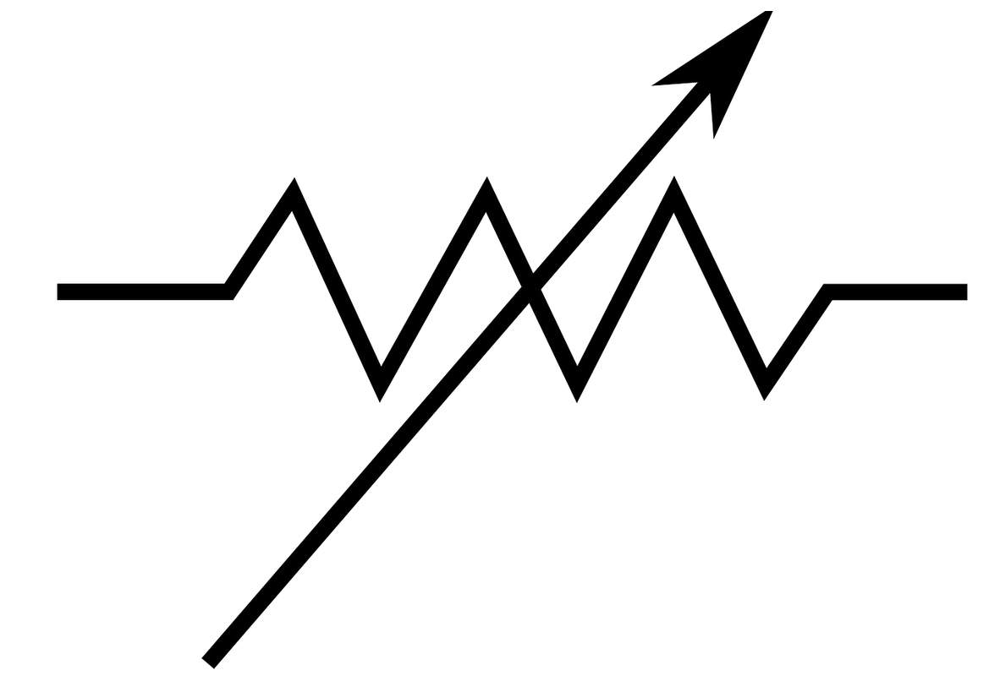

<!-- headingDivider: 2 -->

# Analog Input

==pic of clock and digital clock==

## Analog vs. Digital

- Analog: **infinite** variations / states
- Digital: **discrete** (or **finite**) states
- How do we represent infinite variations in a system that has limited / finite values?

## Recall


## Setting input / output with `pinMode` 

Syntax

```c++
pinMode(PIN_NUMBER, MODE);
//MODE: OUTPUT or INPUT
```

- Most pins on the Argon can be configured to SEND output (e.g. to turn on a light) or to RECEIVE input (e.g. a button press)
- When you want to use a pin in your program, you should specify its mode in `setup()`


## Potentiometer


##




## Credit

- https://www.flickr.com/photos/snazzyguy/4149940565/