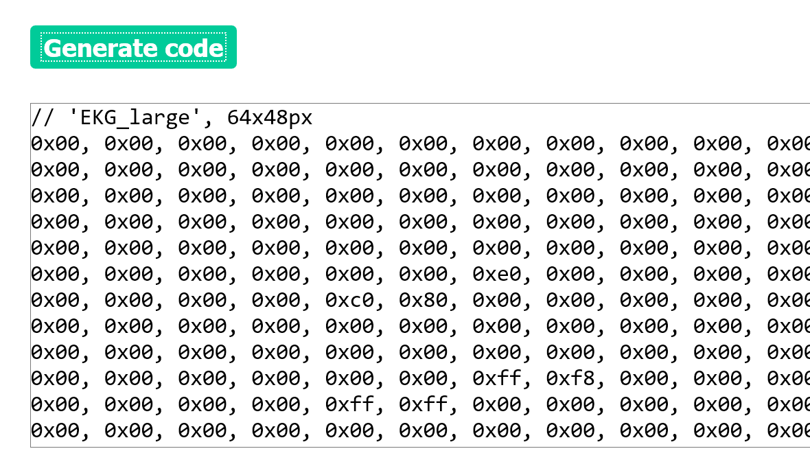

* OLED screen consists of 64 (W) x 48 (H) pixels (3,072 total pixels)
* Each pixel is either ON (HIGH) or OFF (LOW) because there is only one color
* 3,072 pixels means 3,072 bits (ON or OFF) are needed to display a full image

describe in one slide image vs canvas size

Image Restrictions

* Each image to be converted should be black and white
  * Color and greyscale can work but not well

Output Restrictions

* For SparkFun OLED, draw mode is `vertical - 1 byte per pixel`
* If you're using the SparkFun library, the final **canvas size** must be 64x48 pixels

## Tools for converting images to bitmaps

* Online: [Image2CPP](https://javl.github.io/image2cpp/)
* Windows: [LCD Assistant](http://en.radzio.dxp.pl/bitmap_converter/)
* Mac: [bitmapToC](https://github.com/hoiberg/bitmapToC)

